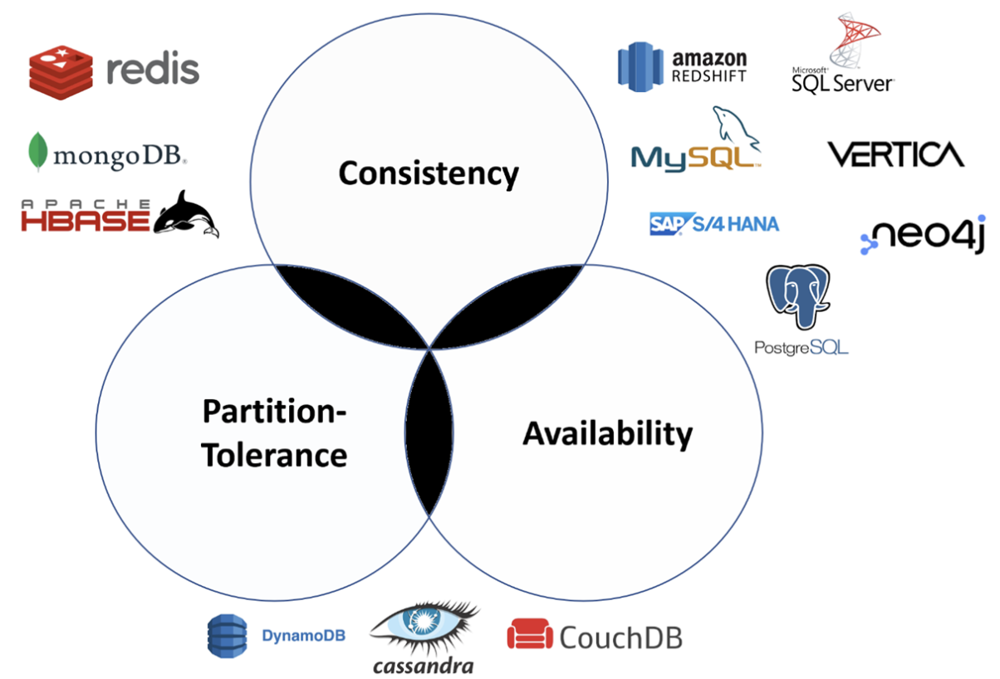

# 다양한 데이터베이스의 특징

1. 데이터베이스의 원칙
    1. data integrity(무결성) 
        1. 데이터가 전송, 저장, 처리되는 과정에서 변경되거나 손상되지 않는 것 
        2. 완전성, 정확성, 일관성을 유지함
    2. data reliability (안전성)
        - 데이터를 보호할 수 있는 방법
        - 인증/인가되지 않은 사용자로부터 데이터를 보호함
        - 고장이 안나야됨
    3. scalability (확장성)
        - 데이터 양이나 사용자가 늘어날 때 대처 가능
        
2. 데이터베이스 종류
    1. relational
        1. 데이터를 row와 column으로 이루어진 table의 형태로 저장함
        2. SQL(Structured Query Language)를 사용해서 데이터를 읽어오거나 조작함
        3. MySQL, Oracle, Postgre 등이 해당
    2. key-value
        1. key-value pair로 데이터를 저장
        2. key는 unique identifier로도 사용됨
        3. redis등이 해당
            - cache
            - message broker → pub/sub
            - not that scalable → limitation on the size of RAM
            - Dynamo DB
                - partiton key - primary.
                - sort key - secondary, optional
                - advantage
                    - scalable →AWS offers, HA, serverless
    3. graph
        1. 데이터를 graph의 형태로 저장
        2. 각 항목이 node로 이루어져있고, node간의 관계는 edge를 사용해서 나타냄\d
            1. 알고리즘 보면 뭐와 뭐간의 거리 이런것 
        3. SNS등 서로 관계가 복잡한 상황에서 자주 사용됨
        4. Neo4j, OrientDB등이 해당
        5. 링크드인 - 1촌, 2촌, 
        
    4. document
        1. document database라고도 함
            1. 구조가 완전 자유로움
        2. row, column과 같은 구조는 없고 자유로운 형태로 데이터를 저장함
            - 일반적으로 JSON 또는 XML 형태
        3. 데이터베이스별로 데이터를 조작할 수 있는 언어가 따로 있음
        4. MongoDB, CassandraDB, Couchbase 등이 해당
        5. 형식이 자유로워야 할 때??
            - 블로그 포스트. 사진이 언제 몇개가 들어갈 지 모르는??
    5. row-oriented vs column-oriented
        1. row - mysql, postgre, hbase
        2. column - cassandra, hbase, BigQuery
        3. example - Netflix - 2.3억명2
3. 서비스에 적합한 데이터베이스 선택법
    1. CAP Theorem
        
        
        
        - consistency(일관성)
            - 데이터베이스 안의 모든 node들이 같은 값을 가지고 있음
            - request를 보내면 해당 request가 delay 될 수 있음
            - 금융 쪽에서 중요하게 생각함
            - 송금 데이터가 데이터베이스 노드당 align되지 않으면? 송금 안된줄 알고 또보내고 또보내고….
        - availability(가용성)
            - 데이터베이스에 request를 보내면 항상 response를 받음
                - consistencty는 response바로 안옴
            - 하지만 해당 response가 가장 최근 데이터라는 것을 보장받을 수 없음
            - 접근하는 node에 따라 값이 다르다
        - partition-tolerance(분산처리)
            - node간 소통이 불가능 하더라도 정상적으로 작동함
        - C - P // A - P // C - A
    2. 3가지를 다 가질 수는 없음. 왜냐면…
        
        
    
    1. 예시 
        - RDBMS - Netflix
            - 영상에 대한 정보를 저장하는 방식
            - 평점 데이터를 가져와서 인공지능과 연결 아마도??  → 사용자가 좋아할 것 같은 영상을 추천한다
        - NoSQL - 인스타그램
            - [Cassandra DB 블로그](https://jasonkang14.github.io/database/cassandra-db)↗️
            - 종종 데이터 날아가는데 몇시간 뒤에 복구함 어떻게 이게 가능한지?
            - 데이터를 저장하는 방식 덕분에/때문에 가능하다

4.관계형 데이터베이스(RDBMS) vs 비관계형 데이터베이스(NoSQL)

1. scale up vs scale out

---

- 서비스에 적합한 데이터베이스는 어떻게 선택할까?
    - 넷플릭스에서는 MySQL
        - 평점을 남길 때 consistency보다 available을 중시
    - 인스타그램에서는 카산드라
        - 온전에게 저장이 됐는지 안됐는지가 더 중요하다
        - consistency가 중요하다
- RDB는 로우와 컬럼에 저장되기 때문에 데이터 정합성이 보장된다.
    - 다만 스키마를 변경하는 것이 쉽지 않다.
    - 스키마가 자주 바뀐다면 적합하지 않다.
    - 분산 저장하지 않기 때문에 데이터 일관성 정합성이 잘 유지된다.
    - 왜 스케일 아웃이 안될까요?
        - 되긴 하는데 테이블이 하나기 떄문에 문제가 많다.
- 레디스는 알아야 한다.
- 블로그 포스트는 NoSQL로 하면 좋다. 스키마가 다 다르니까
- MySQL는 컬럼이 수정되거나 삽입되면 시프트가 없이 그냥 그 자리를 비우거나 채운다
- 컬럼 기반은 select가 느리고 insert가 느리다.
    - 컬럼을 벌려서 넣어야하니까
    - 빅쿼리는 조회를 빨리 해야하니까 Column Oriented Database를 사용하는 것이 좋습니다.
- Q. 스케일 아웃과 샤딩과는 다른 개념인가요?
- Q. 동시성 때문에 오토인크리먼트를 활용한 채번이 스케일 아웃이 안좋은 이유로 생각해도 될까요?
    - 그쵸그쵸 이게 안된다는거죠. 스케일아웃은 중복된 데이터가 들어갈거기 때문에
- 레디스는 타임아웃 걸 때
    - 비대면 진료일 때 환자가 들어와있는지 궁금할 때가 있다. 근데 이건 진료가 끝나면 필요없는 자료다. 디스크에 쓰느니 메모리에 두겠다.
    - 몽고DB는 로그 남길 때