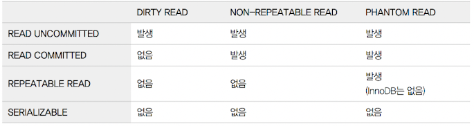
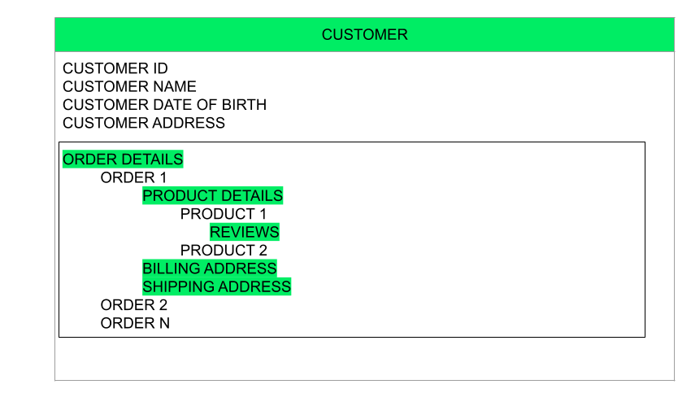
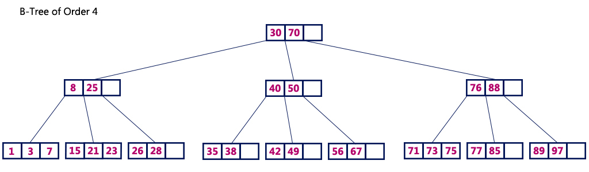

1. 관계형 데이터베이스(RDBMS)와 비관계형 데이터베이스(NoSQL)의 장단점 비교

- 관계형 데이터베이스
  - 장점
    - 명확한 데이터 구조를 보장함
    - 중복없이 데이터 저장 가능함
  - 단점
    - 시스템이 커질 경우 복잡한 쿼리가 만들어질 수 있음
    - Scale-up만 지원, 비용이 기하급수적으로 늘어날 수 있음
    - 스키마가 변경 될 경우 번거롭고 어렵다.
- 비관계형 데이터베이스
  - 장점
    - 스키마가 없기 때문에 유연하고 자유로운 데이터 구조를 가질 수 있다.
    - 데이터를 자유롭게 조정하고 새로운 필드를 추가할 수 있다.
    - 많은 양의 데이터를 저장, 처리 할 수 있음
    - Scale-up, out 지원, 데이터 분산 용이함
  - 단점
    - 중복된 데이터 발생 가능함
    - 데이터 구조가 명확하지 않음
    - key 값에 대한 입출력만 지원

2. 트랜잭션(transaction)이란 무엇인가요?

- 트랜잭션 : 데이터베이스의 상태를 변환시키는 작업 단위
- 특징 : 하나의 트랜잭션은 커밋되거나 롤백된다.
- 성질
  - 원자성(Atomicity)
    - 트랜잭션의 연산은 데이터베이스에 모두 반영되거나 반영되지 않아야 한다.
    - 명령 중 하나라도 오류가 발생하면 트랜잭션 전부 취소되어야 한다.
  - 일관성(Consistency)
    - 명령이 모두 완료되면 일관성 있는 데이터베이스 상태로 변환한다.
    - 시스템이 가지고 있는 고정요소는 트랜잭션 수행 전과 트랜잭션 수행 완료 후의 상태가 같아야 한다.
  - 독립성,격리성(Isolation)
    -  둘 이상의 트랜잭션이 동시에 병행 실행되는 경우 어느 하나의 트랜잭션 실행중에 다른 트랜잭션의 연산이 끼어들 수 없다.
    - 수행중인 트랜잭션은 완전히 완료될 때까지 다른 트랜잭션에서 수행 결과를 참조할 수 없다.
  - 영속성,지속성(Durability)
    - 성공적으로 완료된 트랜잭션의 결과는 시스템이 고장나더라도 영구적으로 반영되어야 한다.
- 연산
  - Commit 연산
    - Commit 연산은 한개의 논리적 단위(트랜잭션)에 대한 작업이 성공적으로 끝났고 데이터베이스가 다시 일관된 상태에 있을 때, 이 트랜잭션이 행한 갱신 연산이 완료된 것을 트랜잭션 관리자에게 알려주는 연산이다
  - Rollback 연산
    - Rollback 연산은 하나의 트랜잭션 처리가 비정상적으로 종료되어 데이터베이스의 일관성을 깨뜨렸을 때, 이 트랜잭션의 일부가 정상적으로 처리되었더라도 트랜잭션의 원자성을 구현하기 위해 이 트랜잭션이 행한 모든 연산을 취소(Undo)하는 연산이다.
    - Rollback 시에는 해당 트랜잭션을 재시작하거나 폐기한다.
- 상태
  - 활동(Active) : 트랜잭션이 실행중인 상태
  - 실패(Failed) : 트랜잭션 실행에 오류가 발생하여 중단된 상태
  - 철회(Aborted) : 트랜잭션이 비정상적으로 종료되어 Rollback 연산을 수행한 상태
  - 부분 완료(Partially Committed) : 트랜잭션의 마지막 연산까지 실행했지만, Commit 연산이 실행되기 직전의 상태
  - 완료(Committed) : 트랜잭션이 성공적으로 종료되어 Commit 연산을 실행한 후의 상태

3. MySQL에서 조인(join)의 역할은 무엇인가요? 다양한 join의 방식에 대해 설명해주세요.

- JOIN : 데이터베이스 내의 여러 테이블에서 가져온 레코드를 조합하여 하나의 테이블이나 결과 집합으로 표현
  - INNER JOIN
    - INNER JOIN은 ON 절과 함께 사용되며, ON 절의 조건을 만족하는 데이터만을 가져오는 JOIN.
    - ON 절에서는 WHERE 절에서 사용할 수 있는 모든 조건을 사용할 수 있음.
     
  - LEFT JOIN
    - LEFT JOIN은 첫 번째 테이블을 기준으로, 두 번째 테이블을 조합하는 JOIN.
    - 이때 ON 절의 조건을 만족하지 않는 경우에는 첫 번째 테이블의 필드 값은 그대로 가져옴.
    - 하지만 해당 레코드의 두 번째 테이블의 필드 값은 모두 NULL로 표시됨.
    - ON 절에서는 WHERE 절에서 사용할 수 있는 모든 조건을 사용할 수 있음.
    
  - RIGHT JOIN
    - LEFT 조인과는 반대로 두 번째 테이블을 기준으로, 첫 번째 테이블을 조합하는 JOIN.
    - ON 절의 조건을 만족하지 않는 경우에는 두 번째 테이블의 필드 값은 그대로 가져옴.
    - 하지만 해당 레코드의 첫 번째 테이블의 필드 값은 모두 NULL로 표시됨.
    - ON 절에서는 WHERE 절에서 사용할 수 있는 모든 조건을 사용할 수 있음.
    

4. MySQL에서 인덱스(index)란 무엇인가요?

- 인덱스(INDEX)
  - 검색 속도를 높이기 위해 사용하는 하나의 기술
  - 해당 테이블의 컬럼을 색인화하여 검색 시 해당 테이블의 레코드를 FULL SCAN 하는 게 아니라 색인화되어 있는 인덱스 파일을 검색하여 검색을 빠르게 함.
