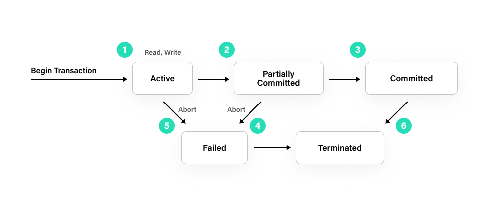

### 관계형 데이터베이스(RDBMS)와 비관계형 데이터베이스(NoSQL)의 장단점 비교

- **관계형 데이터베이스(RDBMS)**
  - 장점
    - 데이터의 무결성을 보장한다.
    - 각 데이터는 중복없이 한 번만 저장된다.
    - 데이터베이스를 추가하기 전에 유효성 검사를 통해 데이터 품질을 향상시킬 수 있다.
    - VIEW를 이용한 보안설정으로 허가되지 않은 사용자들로 부터 조회, 변경, 삭제를 막을 수 있다.
    - 관계형 데이터베이스들은 같은 오픈 소스를 공유하는 경우가 많기 때문에 다른 개발 환경에 쉽게 적응할 수 있다.
  
  - 단점
    - 관계를 맺고 있기 때문에 Join문이 많은 복잡한 쿼리가 만들어질 수 있다.
    - 복잡한 쿼리가 만들어졌을 경우 수정이 어렵거나 불가능 할 수 있다.
    - 데이터베이스의 모델링이 개발 전에 완료돼야 하기때문에 개발 속도가 느릴 수 있다.
    - 수평적 확장이 어렵고, 대체로 수직적 확장만 가능하기 떄문에 데이터 처리량에 한계가 있다.
    - 가변성이 있는 데이터의 경우 테이블에 저장하는것이 쉽지 않다.
    

- **비관계형 데이터베이스(NoSQL)**
  - 장점
    - 데이터 모델링이 완료되기 이전에도 테스트 데이터의 조회가 가능하다.
    - 스키마가 없기떄문에 훨씬 더 유연하다. 언제든지 저장한 데이터를 조정할 수 있다.
    - 다양한 가변성이 있는 데이터의 저장이 쉽다.
    - 데이터가 애플리케이션이 필요로 하는 형식으로 저장되기 때문에 데이터를 읽어오는 속도가 빠르다.
    - 수직 및 수평적 확장이 모두 가능하므로 애플리케이션에서 발생하는 모든 읽기, 쓰기 요청의 처리가 가능하다.
   
  - 단점
    - 유연성 때문에 데이터 구조 결정이 어려울 수 있다.
    - 문서 저장이 단위 요소 수준에서 세밀한 보안을 제공하지 않는다.
    - NoSQL마다 쿼리 언어를 각기 다르게 사용하는 경우가 많아 이식성이 낮다.
    - 데이터베이스의 컬렉션이 다양할 경우, 수정할 때에 모든 컬렉션의 데이터를 수정해야 한다.

### 트랜잭션(transaction)이란 무엇인가요?

- **트랜잭션**이란 하나의 작업 단위를 말한다.
하나의 논리적인 작업 셋에 하나의 쿼리가 있든 두 개 이상의 쿼리가 있든 관계없이 논리적인 작업 셋 자체가 100% 적용 (commit) 되거나 아무것도 적용되지 않아야 (ROLLBACK 또는 ROLLBACK시키는 오류가 발생했을때) 함을 보장해 주는 것이다.

- **트랜잭션 격리 수준**(isolation level) : 여러 트랜잭션이 동시에 처리될때 특정 트랜잭션이 다른 트랜잭션에서 변경하거나 조회하는 데이터를 볼 수 있게 허용할지 말지를 결정하는 것이다.
- 트랜잭션 격리 수준의 각 레벨과 세 가지 부정합의 문제 

- **READ UNCOMMITTED** : 트랜잭션이 commit 혹은 rollback되지 않아도 다른 트랜잭션에서 조회가 가능하다. 이를 Dirty Read라고 하는데 조회한 트랜잭션은 해당 트랜잭션이 완료됐는지 여부에 상관없이 자신의 작업을 처리하기 때문에 혼란이 생길 가능성이 크다.

- **READ COMMITTED** : 트랜잭션이 commit 돼야 다른 트랜잭션에서 해당 데이터를 조회할 수 있다. 만약 트랜잭션 진행중 조회를 시도한다면 언두(Undo) 로그에 백업된 이전 데이터를 조회하게 된다. 이는 NON-REPEATABLE READ라는 정합성 문제를 발생시킨다. 매 조회시 마다 다른 결과를 도출할 수 있기 때문에 문제가 발생할 여지가 있다.

- **REPEATABLE READ** : READ COMMITTED와 비슷하게 commit 되지 않은 데이터를 다른 트랜잭션이 조회했을 경우 이전 데이터를 백업해두고 백업된 데이터를 볼 수 있도록 한다. 차이점은 REPEATABLE READ를  보장한다는 것이다. commit 이후에 조회 요청을 했던 다른 트랜잭션이 조회를 하더라도 백업되어 있던 데이터를 조회하도록 해준다. 즉, 트랜잭션간 번호를 구분해 나보다 이전의 트랜잭션이라면 동일한 결과가 나오도록 한다. 그러나 트랜잭션 처리중 다른 트랜잭션이 Insert문으로 데이터를 넣게 되면 이전 결과와 다른 결과를 얻을 수 있다. (PHANTOM READ) 이 부정합은 SERIALIZABLE 격리 수준에서 해결할 수 있지만 MySQL은 갭 락과 넥스트키 락으로 팬텀리드를 해당 레벨에서 방지할 수 있다.

- **SERIALIZABLE** : 단순하게 트랜잭션 처리중에는 데이터에 대한 접근을 막는 수준이다. 당연히 부정합의 문제는 사라지겠지만 성능에 치명적이기 때문에 대부분의 DB에서 채택하지 않는다.

- (Real MySQL 8.0 도서 내용 발췌)

### MySQL에서 조인(join)의 역할은 무엇인가요? 다양한 join의 방식에 대해 설명해주세요.

- 조인이란 한 데이터베이스 내의 여러 테이블의 레코드를 조합하여 하나의 열로 표현한 것이다. 따라서 조인은 테이블로서 저장되거나, 그 자체로 이용할 수 있는 결과 셋을 만들어 낸다.

- **INNER JOIN** : 가장 흔히 사용되는 JOIN이다, JOIN한 두 테이블의 공통된 부분을 검색하여 결과를 가져온다.
- **NATUAL JOIN** : 자연 조인은 조인된 테이블에서 동일한 칼럼명을 가진 2개의 테이블에서 모든 컬럼을 비교한다. 결과적으로 같은 이름의 필드에 대해서는 하나만 보여주게 된다.
- **LEFT OUTER JOIN** : LEFT OUTER JOIN은 왼쪽 테이블의 모든 데이터 중 오른쪽 테이블과 매칭이되는 레코드를 포함시킨다.
- **RIGHT OUTER JOIN** : RIGHT OUTER JOIN은 오른쪽 테이블의 모든 데이터 중 왼쪽 테이블과 매칭이되는 레코드를 포함시킨다.

### MySQL에서 인덱스(index)란 무엇인가요?

- 인덱스란 책 색인(찾아보기)와 같다. 데이터베이스 테이블의 모든 데이터를 검색해서 원하는 결과를 가져오려면 시간이 많이 걸린다. 그래서 자주 검색이 되는 레코드는 따로 기억해 해당 레코드가 저장된 주소를 키와 값의 쌍(key - Value pair)로 저장해 두는것이다.   

